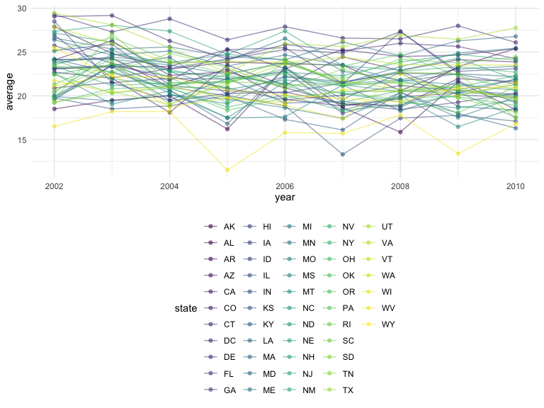
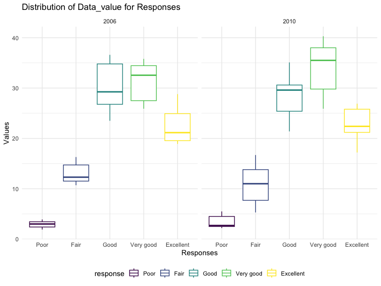
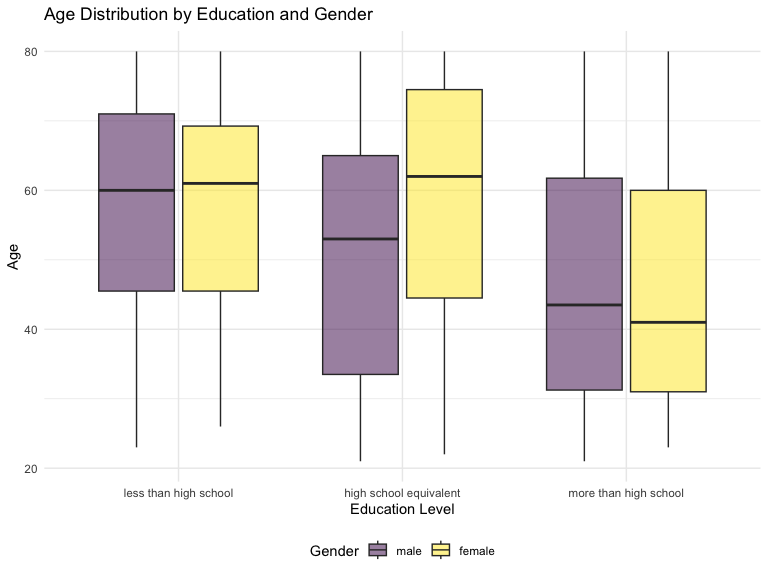
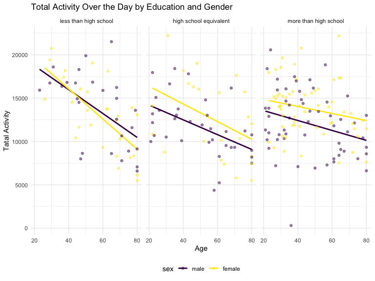
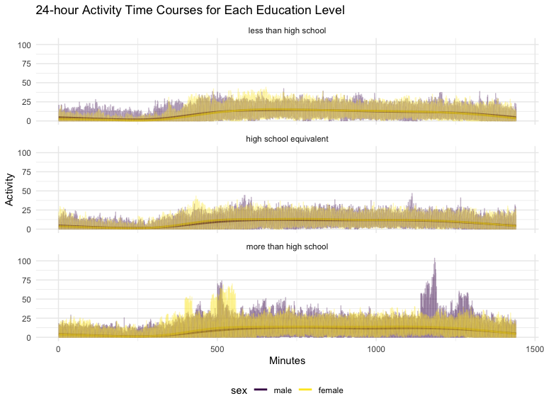

p8105_hw3_jl6325
================
Jianing Liu
2023-10-10

# Problem 1

``` r
data("instacart")

instacart = 
instacart |>
  as_tibble()
```

``` r
instacart |> 
  count(aisle) |> 
  arrange(desc(n))
```

    ## # A tibble: 134 × 2
    ##    aisle                              n
    ##    <chr>                          <int>
    ##  1 fresh vegetables              150609
    ##  2 fresh fruits                  150473
    ##  3 packaged vegetables fruits     78493
    ##  4 yogurt                         55240
    ##  5 packaged cheese                41699
    ##  6 water seltzer sparkling water  36617
    ##  7 milk                           32644
    ##  8 chips pretzels                 31269
    ##  9 soy lactosefree                26240
    ## 10 bread                          23635
    ## # ℹ 124 more rows

Next is a plot that shows the number of items ordered in each aisle.
Here, aisles are ordered by ascending number of items.

``` r
instacart |> 
  count(aisle) |> 
  filter(n > 10000) |> 
  mutate(aisle = fct_reorder(aisle, n)) |> 
  ggplot(aes(x = aisle, y = n)) + 
  geom_point() + 
  labs(title = "Number of items ordered in each aisle") +
  theme(axis.text.x = element_text(angle = 60, hjust = 1))
```


``` r
instacart |> 
  filter(aisle %in% c("baking ingredients", "dog food care", "packaged vegetables fruits")) |>
  group_by(aisle) |> 
  count(product_name) |> 
  mutate(rank = min_rank(desc(n))) |> 
  filter(rank < 4) |> 
  arrange(desc(n)) |>
  knitr::kable()
```

| aisle                      | product_name                                  |    n | rank |
|:---------------------------|:----------------------------------------------|-----:|-----:|
| packaged vegetables fruits | Organic Baby Spinach                          | 9784 |    1 |
| packaged vegetables fruits | Organic Raspberries                           | 5546 |    2 |
| packaged vegetables fruits | Organic Blueberries                           | 4966 |    3 |
| baking ingredients         | Light Brown Sugar                             |  499 |    1 |
| baking ingredients         | Pure Baking Soda                              |  387 |    2 |
| baking ingredients         | Cane Sugar                                    |  336 |    3 |
| dog food care              | Snack Sticks Chicken & Rice Recipe Dog Treats |   30 |    1 |
| dog food care              | Organix Chicken & Brown Rice Recipe           |   28 |    2 |
| dog food care              | Small Dog Biscuits                            |   26 |    3 |

``` r
instacart |>
  filter(product_name %in% c("Pink Lady Apples", "Coffee Ice Cream")) |>
  group_by(product_name, order_dow) |>
  summarise(mean_hour = mean(order_hour_of_day)) |>
  pivot_wider(
    names_from = order_dow,
    values_from = mean_hour
  ) |>
  knitr::kable(digits = 2)
```

    ## `summarise()` has grouped output by 'product_name'. You can override using the
    ## `.groups` argument.

| product_name     |     0 |     1 |     2 |     3 |     4 |     5 |     6 |
|:-----------------|------:|------:|------:|------:|------:|------:|------:|
| Coffee Ice Cream | 13.77 | 14.32 | 15.38 | 15.32 | 15.22 | 12.26 | 13.83 |
| Pink Lady Apples | 13.44 | 11.36 | 11.70 | 14.25 | 11.55 | 12.78 | 11.94 |

# Problem 2

``` r
data("brfss_smart2010")

brfss_smart2010 = 
  brfss_smart2010 |>
  as.tibble()
```

``` r
bs =
  brfss_smart2010 |>
  rename(state = Locationabbr,
         county = Locationdesc) |>
  janitor::clean_names() |>
  filter(topic == "Overall Health",
         response %in% c("Excellent", "Very good", "Good", "Fair", "Poor")) %>%
  mutate(response = factor(response, 
                           levels = c("Poor", "Fair", "Good", "Very good", "Excellent"),
                           ordered = TRUE))
```

``` r
bs |>
  filter(year == 2002) |>
  group_by(state) |>
  summarise(n_county = n_distinct(county)) |>
  filter(n_county >= 7)
```

    ## # A tibble: 6 × 2
    ##   state n_county
    ##   <chr>    <int>
    ## 1 CT           7
    ## 2 FL           7
    ## 3 MA           8
    ## 4 NC           7
    ## 5 NJ           8
    ## 6 PA          10

``` r
bs |>
  filter(year == 2010) |>
  group_by(state) |>
  summarise(n_county = n_distinct(county)) |>
  filter(n_county >= 7)
```

    ## # A tibble: 14 × 2
    ##    state n_county
    ##    <chr>    <int>
    ##  1 CA          12
    ##  2 CO           7
    ##  3 FL          41
    ##  4 MA           9
    ##  5 MD          12
    ##  6 NC          12
    ##  7 NE          10
    ##  8 NJ          19
    ##  9 NY           9
    ## 10 OH           8
    ## 11 PA           7
    ## 12 SC           7
    ## 13 TX          16
    ## 14 WA          10

In 2002, there are 6 states were observed at 7 or more location; In
2010, there are 14 states were observed at 7 or more location.

``` r
excellent = 
  bs |>
  filter(response == "Excellent") |>
  group_by(year, state) |>
  summarise(average = mean(data_value))
```

    ## `summarise()` has grouped output by 'year'. You can override using the
    ## `.groups` argument.

``` r
excellent |>
  ggplot(aes(x = year, y = average, color = state)) +
  geom_point(alpha = .5) +
  geom_line(alpha = .5)
```



``` r
  labs(x = "Year", y = "Average Values for the Data",
       title = "Average values for Each State Across Years")
```

    ## $x
    ## [1] "Year"
    ## 
    ## $y
    ## [1] "Average Values for the Data"
    ## 
    ## $title
    ## [1] "Average values for Each State Across Years"
    ## 
    ## attr(,"class")
    ## [1] "labels"

Based on the plot above, the Excellent rating across all states shows
that there is a noticeable variance but hard to identify the overall
trends.

``` r
bs |>
  filter(year %in% c(2006,2010), state == "NY") |>
  ggplot(aes(x = response, y = data_value, color = response)) +
  geom_boxplot() + 
  facet_wrap(~year) +
  labs(x = "Responses",
       y = "Values",
       title = "Distribution of Data_value for Responses"
  )
```



Based on the plot above, 2006 and 2010 had relatively similar rating
distributions, but 2010 overall contained larger range than 2006.

# Problem 3

``` r
nc = 
  read_csv("data/nhanes_covar.csv", skip = 4) |>
  janitor::clean_names() |>
  filter(age >= 21) |>
  drop_na()
```

    ## Rows: 250 Columns: 5
    ## ── Column specification ────────────────────────────────────────────────────────
    ## Delimiter: ","
    ## dbl (5): SEQN, sex, age, BMI, education
    ## 
    ## ℹ Use `spec()` to retrieve the full column specification for this data.
    ## ℹ Specify the column types or set `show_col_types = FALSE` to quiet this message.

``` r
na = 
  read.csv("data/nhanes_accel.csv") |>
  janitor::clean_names()

nhanes =
  inner_join(na, nc, by = "seqn")
```

Load, tidy, and merge the datasets in to “nhanes” dataset.

``` r
nhanes$seqn <- as.integer(nhanes$seqn)

nhanes$sex <- factor(nhanes$sex,
                     levels = c("1", "2"),
                     labels = c("male", "female"))

nhanes$education <- factor(nhanes$education,
                           levels = c("1", "2", "3"),
                           labels = c("less than high school", "high school equivalent", "more than high school"))

nhanes$age <- as.integer(nhanes$age)

nhanes$bmi <- as.numeric(nhanes$bmi)
```

``` r
nhanes |>
  group_by(sex, education) |>
  summarise(count = n()) |>
  pivot_wider(names_from = education, values_from = count) |>
  knitr::kable()
```

    ## `summarise()` has grouped output by 'sex'. You can override using the `.groups`
    ## argument.

| sex    | less than high school | high school equivalent | more than high school |
|:-------|----------------------:|-----------------------:|----------------------:|
| male   |                    27 |                     35 |                    56 |
| female |                    28 |                     23 |                    59 |

The table above shows that there are 27 males and 28 females in the
category less than high school, there are 35 males and 23 females in the
category high school equivalent, and there are 56 males and 59 females
in the category more than high school.

``` r
nhanes |>
  ggplot(aes(x = education, y = age, fill = sex)) +
  geom_boxplot(alpha = .5) +
  labs(x = "Education Level",
       y = "Age",
       fill = "Gender",
       title = "Age Distribution by Education and Gender"
  )
```



Based on the plot above, we can see that for category less than high
school and more than high school, the overall age distribution for male
and female are similar in these two groups, but for category high school
equivalent male are younger than female, and for category less than high
school has the smallest range for all these 3 categories.

``` r
nhanes_total_activity <-
  nhanes |>
  mutate(total_activity = rowSums(across(min1:min1440), na.rm = TRUE))

nhanes_total_activity |>
  ggplot(aes(x = age, y = total_activity, color = sex)) +
  geom_smooth(method = lm, se = FALSE) +
  geom_point(alpha = .5) +
  facet_grid(~ education) +
  labs(x = "Age",
       y = "Tatal Activity",
       title = "Total Activity Over the Day by Education and Gender")
```

    ## `geom_smooth()` using formula = 'y ~ x'



Based on the plot above, we can see that the overall association between
total activity and age is negative, which means there is a decreased
amount of total activity with age and the trend are the same for both
gender. The total activity for categories high school equivalent and
more than high school shows that female tend to have more total activity
on average. And for category less than high school, totaly activity
decrease the most as their age inscrease.

``` r
nn <-
  nhanes |>
  pivot_longer(cols = starts_with("min"),
               names_to = "minute",
               values_to = "activity") |>
  mutate(minute = as.integer(gsub("min", "", minute)))
         
nn |>
  ggplot(aes(x = minute, y = activity, color = sex)) +
  geom_smooth(se = FALSE) +
  geom_line(alpha = .3) +
  facet_wrap(~ education, ncol = 1) +
  labs(x = "Minutes",
       y = "Activity",
       title = "24-hour Activity Time Courses for Each Education Level")
```

    ## `geom_smooth()` using method = 'gam' and formula = 'y ~ s(x, bs = "cs")'



Based on the plot above, it is hard to tell the different of 24-hour
activity time courses between male and female for all three education
levels. Overall, at about the 250th minute is the least amount of
activity of the day. Overall, there is higher amount of activity among
female compare to male.
